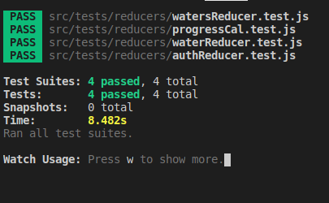

# Water Tracking App

> This is a simple app for tracking the amount of water consumed in a day. An authorized user
can enter the amount out water, enter the target amount and gets a feedback of the progress made. User can edit, delete or add water data to track. A visual representation of the data.


## Future Feature

- Add weight feature
- Minutes of exercise in a day

To get the accurate data

## Tools To Work With

- Node.js
- React
- React-DOM
- React-Create-App
- npm
- React
- Redux
- Styled-components
- Heroku

## Deployment

- ``` heroku create $APP_NAME --buildpack mars/create-react-app```
- ``` git push heroku setup:master ```
- ` heroku open `

## Live Demo

[Live Demo Link](https://addo-water.herokuapp.com/)


## Getting Started

To get a local copy up and running follow these simple example steps.

1. ``` git clone https://github.com/addod19/track_it ```
2. ``` cd track_it ```
3. ``` npm install ```
4. ``` npm start ```

## Run Test

- `npm test`



## Screenshot


This project was bootstrapped with [Create React App](https://github.com/facebook/create-react-app).


### Prerequisites

- A modern browser

## Authors

👤 **Daniel Larbi Addo**

- Github: [@addod19](https://github.com/addod19)
- Twitter: [@DanielLarbiAdd1](https://twitter.com/DanielLarbiAdd1)
- Linkedin: [Daniel Larbi Addo](https://linkedin.com/in/daniel-larbi-addo/)
- Email: (addodaniellarbi@gmail.com)

## 🤝 Contributing

Contributions, issues and feature requests are welcome!

Feel free to check the [issues page](https://github.com/addod19/track_it/issues).


1. Fork it (https://github.com/addod19/track_it/fork)
2. Create your feature branch (git checkout -b my-new-feature)
3. Commit your changes (git commit -am 'Add some feature')
4. Push to the branch (git push origin my-new-feature)
5. Create a new Pull Request

## Show your support

Give us a ⭐️ if you like this project!

## Acknowledgments

- MIcroverse
- Microverse TSE's

## 📝 License

This project is [Apache](lic.url) licensed.
